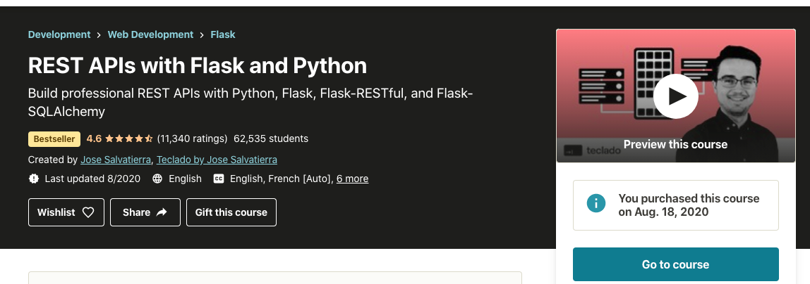
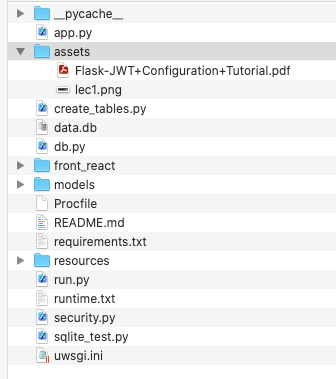

## Stores REST Api
This is built with Flask, Flask-RESTful, Flask-JWT, and Flask-SQLAlchemy.


## GitHub
- ssh
    - git@github.com:lux600/test-udemy-rest-flask1.git

### …or create a new repository on the command line
~~~
echo "# test-udemy-rest-flask1" >> README.md
git init
git add README.md
git commit -m "first commit"
git branch -M main
git remote add origin git@github.com:lux600/test-udemy-rest-flask1.git
git push -u origin main
~~~

### …or push an existing repository from the command line
~~~
git remote add origin git@github.com:lux600/test-udemy-rest-flask1.git
git branch -M main
git push -u origin main
~~~


## 기존 모두 삭제하고 github 다시 올릭 
~~~
git push -u --force origin main
~~~
---

- https://www.udemy.com/course/rest-api-flask-and-python/



---
- https://github.com/tecladocode/rest-api-sections/
---

## local 
~~~
/Users/mac/Dropbox/pythonproject/dev_book/python_lec_rest_flash_1/code_sqlalchemy
~~~



---

- virtualenv
~~~
$ virtualenv venv --python=python3.5

$ source venv/bin/activate
~~~
- pyenv virtualenv
```c {.line-numbers}
$ pyenv virtualenv 3.7.5 python_rest_flask_udemy

Looking in links: /var/folders/4v/7ql0tb592lz069rp49s9fp080000gn/T/tmpw3sol5cq
Requirement already satisfied: setuptools in /Users/mac/.pyenv/versions/3.7.5/envs/python_rest_flask_udemy/lib/python3.7/site-packages (41.2.0)
Requirement already satisfied: pip in /Users/mac/.pyenv/versions/3.7.5/envs/python_rest_flask_udemy/lib/python3.7/site-packages (19.2.3)

/Users/mac/.pyenv/version
```

- 현재 생성된 가상환경 
~~~
$ pyenv versions

  3.7.5
  3.7.5/envs/python_microservice
  3.7.5/envs/python_rest_flask_udemy
  3.7.5/envs/python_web_flask
  3.7.5/envs/python_web_programming_flask
  python_microservice
  python_rest_flask_udemy
  python_web_flask
  python_web_programming_flask
~~~

- 가상환경 진입
~~~
$ pyenv activate python_rest_flask_udemy 
~~~

- 가상환경 탈출 
~~~
(python_rest_flask_udemy) $ pyenv deactivate
~~~

- 가상환경 삭제
~~~
$ pyenv uninstall [ 가상환경이름 ]
~~~

---
## freeze
~~~
$ pip freeze > requirements.txt
~~~
~~~
$ pip install -r requirements.txt
~~~
--- 
## flask
~~~
(가상환경) $ pip install flask 
~~~ 

## flask_restful
~~~
(가상환경) $ pip install flask_restful
~~~

## Authentication : JSON Web Token
~~~
(가상환경) $ pip install Flask-JWT
~~~

## sqlite3
~~~
(가상환경) $ pip install pysqlite3 
~~~

## Flask-SQLAlchemy
~~~
(가상환경) $ pip install Flask-SQLAlchemy
~~~


## uwsgi
~~~
(가상환경) $ pip install uwsgi
~~~

## Postgres
- mac
~~~
$ brew install postgresql
~~~

- centos
~~~
$ sudo yum install postgresql postgresql-devel python-devel
~~~
- install
~~~
$ pip install psycopg2
$ pip install psycopg2-binary
~~~

